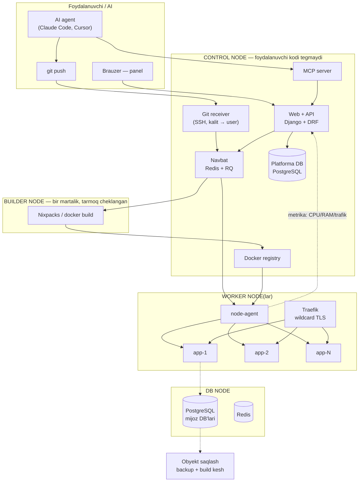
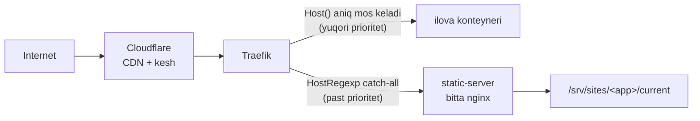

# 03 — Texnik arxitektura

## 3.1 Umumiy ko'rinish



## 3.2 Komponentlar

### 1) Web + API (control node)

**Tanlov: Django + DRF + HTMX + Tailwind**

Sabab:
- `django-allauth` Google va GitHub OAuth'ni **tayyor** beradi — bu bizning
  asosiy talabimiz ("google github orqali ro'yxatdan o'tish")
- Django admin — birinchi 6 oy uchun operator paneli bepul keladi
- Sizda Django tajribasi bor (hotelbookingbot)
- HTMX + Tailwind: yakka dasturchi uchun Next.js'dan **2–3 barobar tez**.
  SPA'ning real foydasi faqat log oqimi, u esa SSE bilan hal bo'ladi

Alternativa: FastAPI + Next.js — chiroyliroq va "zamonaviy", lekin ikki
kodbaza, ikki deploy, auth'ni qo'lda yozish. MVP tezligini o'ldiradi.

API: `/api/v1/...`, token autentifikatsiya (CLI va MCP shu orqali ishlaydi).

### 2) Autentifikatsiya

| Yo'l | Nima uchun |
|---|---|
| Google OAuth | Eng keng, eng oson. Asosiy kirish yo'li |
| **GitHub App** (OAuth emas!) | Repo o'qish + `push` webhook + per-repo ruxsat. OAuth App faqat kirish beradi, repo avtomatik deploy uchun GitHub **App** kerak |
| Telegram Login | O'zbek bozori uchun kuchli — ko'pchilikda Google akkaunt chala. Keyingi bosqich |
| Email+parol | ❌ Kiritmaslik. Parol tiklash, spam, xavfsizlik — ortiqcha ish |

Har foydalanuvchiga ro'yxatdan o'tishda **platforma SSH kaliti**
avtomatik yaratiladi/qabul qilinadi (quyida 3.4).

### 3) Navbat va ishchilar

**Redis + RQ** (Celery emas — RQ ancha sodda, bizga beat/chord kerak emas).

Navbat turlari:
| Navbat | Ish |
|---|---|
| `build` | kodni olish → image yasash → registry'ga push |
| `deploy` | worker node'da konteynerni yangilash |
| `metering` | har soat resurs o'lchovini yig'ish |
| `maintenance` | backup, uxlab qolgan ilovalarni to'xtatish, log tozalash |

### 4) node-agent (har worker node'da)

Kichik demon (Go yoki Python+FastAPI). Control plane **to'g'ridan-to'g'ri
Docker socket'ga ulanmaydi** — faqat agent orqali gaplashadi.

```
POST /containers        → image, env, limitlar bilan ishga tushirish
POST /containers/:id/stop
GET  /containers/:id/logs?follow=1
GET  /metrics           → har konteyner uchun CPU-sekund, RAM, tarmoq
GET  /health
```
mTLS + umumiy sir bilan himoyalanadi, tashqi internetdan **yopiq**
(faqat private network).

> MVP soddalashtirishi: Bosqich 1 da agent o'rniga Docker API ni TLS orqali
> ishlatish mumkin. Lekin **interfeys boshidan agent shaklida** yozilsin —
> keyin ichini almashtirish 1 kunlik ish bo'ladi.

### 5) Router — Traefik

- Docker provider: konteyner yorliqlari (`labels`) dan marshrutni **o'zi** oladi
- Wildcard TLS: `*.app.<brend>.uz` — Cloudflare DNS-01 orqali bir marta
  olinadi, har yangi ilova uchun sertifikat so'rashga hojat yo'q
- **Mijozning o'z domeni** (`mijoz.uz`): HTTP-01 yoki Caddy'ning
  on-demand TLS'i. Bu Bosqich 4
- Rate limit, kompressiya, access log — plagin darajasida

Nginx emas — nginx dinamik konfiguratsiyani yaxshi ko'tarmaydi (har deployda
reload). Traefik konteyner paydo bo'lishini o'zi ko'radi.

### 6) Loglar

- Bosqich 1: `docker logs` → agent → SSE orqali panelga oqim.
  Oxirgi 1000 qator Postgres'da
- Bosqich 3: Vector/Fluent Bit → **Loki**. Qidiruv, saqlash muddati
  tarifga bog'liq (Free 1 kun, Pro 30 kun)

### 7) Metering (billing uchun — 05-hujjat)

Agent har 60 sekundda `docker stats` dan yig'adi, control plane soatlik
rollup qiladi:
```
app_usage_hourly(app_id, hour, cpu_seconds, mem_gb_hours, egress_gb, disk_gb)
```
Bu jadval **billingning yagona haqiqat manbasi**. Boshidan to'g'ri
yozilishi kerak — keyin tiklab bo'lmaydi.

### 8) Ma'lumotlar bazasi xizmat sifatida

- Alohida DB node'da **bitta PostgreSQL klaster**
- Har ilovaga: alohida `DATABASE` + alohida `ROLE` + `CONNECTION LIMIT`
- `DATABASE_URL` env sifatida avtomatik kiritiladi
- Backup: `pg_dump` → obyekt saqlash, kunlik, saqlash muddati tarifga bog'liq
- Redis: shu usulda, alohida `ACL` foydalanuvchi + namespace

⚠️ Tuzoq: umumiy klasterda bitta mijozning og'ir so'rovi hammani sekinlatadi.
`statement_timeout`, `CONNECTION LIMIT` va `pg_stat_statements` monitoring
boshidan qo'yiladi. Pro tarifda — alohida konteyner-DB.

### 9) Env va sirlar

- Postgres'da **shifrlangan** holda (`Fernet`, kalit faqat env'da, DB'da emas)
- Konteyner ishga tushganda kiritiladi
- ⚠️ Logga **hech qachon** tushmasligi kerak — build log'ini filtrlash
- Panelda ko'rsatilmaydi, faqat "o'zgartirish" (write-only), yoki aniq
  "ko'rsatish" bosilganda + qayta auth

## 3.2a Ilova turlarini aniqlash — "statik" nimani bildiradi

Bu platformaning **eng muhim tasniflash mantiqi**: tur tannarxni, tarifni
va deploy quvurini belgilaydi. "Frontend" degan bitta so'z ostida
aslida **uch xil** narsa yashiringan.

| # | Tur | Misol | Build | Runtime RAM | Tannarx |
|---|---|---|---|---|---|
| **1** | **Toza statik** | `index.html` + `style.css` + `script.js` | ❌ yo'q | **0 MB** | ~0 — faqat disk |
| **2** | **Build qilinib statik bo'ladigan (SPA)** | React (CRA/Vite), Vue, Svelte, Astro, Angular, Tailwind bilan statik | ✅ `npm run build` → `dist/` | **0 MB** | Faqat build vaqti |
| **3** | **SSR / Node runtime** | Next.js (SSR yoki API routes), Nuxt, Remix, SvelteKit (node adapter) | ✅ | **80–250 MB** | Doimiy konteyner |
| **4** | **Backend** | Express, FastAPI, Django, aiogram bot | ✅ | 60–350 MB | Doimiy konteyner |

### Kalit tushuncha

> **1 va 2-tur runtime'da bir xil** — ikkisi ham oxirida shunchaki
> fayllar. Farqi faqat build bosqichida.

Demak 2-tur (React, Vue, Vite) ham **bepul tarifga kiradi** — konteyner
umuman ishga tushmaydi, faqat build qilinadi va natija fayl sifatida
qoladi. Bu muhim mahsulot qarori: AI yozgan React saytlarining aksariyati
bizga **pul turmaydi**, lekin foydalanuvchini jalb qiladi.

3-tur esa Next.js bo'lsa ham **statik emas** — Node protsessi doimiy
ishlaydi, demak pulli tarif. Foydalanuvchiga buni **oldin** aytish kerak,
aks holda "men shunchaki sayt qo'ydim, nega pul so'rayapsiz?" deydi.

### Aniqlash (detection) tartibi

```
1. hosting manifest (<brend>.json) bormi?     → unda yozilgani
2. Dockerfile bormi?                          → 4-tur, docker build
3. package.json bormi?
   ├─ "scripts.build" bor va chiqish papkasi (dist/build/out) statikmi?
   │     └─ next.config + SSR belgisi bormi?  → 3-tur
   │        yo'q                              → 2-tur ✅ bepul
   └─ "scripts.start" bor, build chiqishi yo'q → 3/4-tur
4. requirements.txt / pyproject.toml bormi?   → 4-tur (Python)
5. index.html root'da, package.json yo'q      → 1-tur ✅ bepul
6. Hech biri                                  → xato + tushunarli xabar
```

⚠️ **Nixpacks o'zi 1-turni yaxshi aniqlamaydi** — `package.json` bo'lmasa
nima qilishni bilmaydi. Shu sababli **1 va 2-tur uchun o'z aniqlovchimiz**
Nixpacks'dan **oldin** ishlaydi. Bu MVP'ning birinchi yozilishi kerak
bo'lgan qismi, chunki eng ko'p foydalanuvchi shu yerdan keladi.

### Statik sayt uchun alohida quvur (konteynersiz)

```
git push → build (agar kerak bo'lsa) → dist/ papkasi
         → obyekt saqlash yoki worker disk: /srv/sites/<app_id>/
         → umumiy Caddy/Traefik host bo'yicha shu papkani beradi
```
Konteyner **umuman yaratilmaydi**. Natija:
- Bitta node'ga **minglab statik sayt** sig'adi
- Deploy 2–5 sekund (konteyner ko'tarilishini kutish yo'q)
- Atomik almashish: yangi papkaga yozib, symlink'ni burish → rollback bir sekund

### Zichlik qanday texnologiya bilan olinadi

> ⚠️ Aniqlik: "cheksiz" emas. Realistik **~8–10 ming statik sayt / node**,
> va cheklovchi omil **disk**, sayt soni emas. Tarif jadvalidagi `∞` —
> siyosat (fair use), fizik chegara emas.

Zichlikni to'rtta texnologiya beradi:

#### 1. Bitta umumiy veb-server, har saytga konfiguratsiya **yozilmaydi**

Eng muhim nuqta: har sayt uchun alohida konteyner ham, alohida `server`
bloki ham yaratilmaydi. **Bitta nginx** Host sarlavhasini o'qib papkani
o'zi topadi:

```nginx
server {
    listen 443 ssl;
    http2 on;
    # regexp'dagi nomli guruh o'zgaruvchiga aylanadi
    server_name ~^(?<app>[a-z0-9][a-z0-9-]{0,61})\.app\.<brend>\.uz$;

    ssl_certificate     /etc/ssl/wildcard/fullchain.pem;   # bitta wildcard
    ssl_certificate_key /etc/ssl/wildcard/privkey.pem;

    root /srv/sites/$app/current;

    location / {
        try_files $uri $uri/ /index.html;   # SPA fallback
    }
}
```

**Shu 15 qator — cheksiz sayt uchun.** Yangi sayt qo'shilganda nginx
reload ham qilinmaydi: shunchaki `/srv/sites/<nom>/` papkasi paydo bo'ladi.

🔒 Xavfsizlik: `server_name` regexp'i `[a-z0-9-]` bilan chegaralangan —
`$app` ichiga `..` yoki `/` tusha olmaydi, demak papkadan chiqish
(path traversal) imkonsiz. **Bu regexp'ni kengaytirmaslik kerak.**

Caddy varianti (undan ham qisqa, `labels` o'rin egasi bilan):
```caddy
*.app.<brend>.uz {
    tls /etc/ssl/wildcard/fullchain.pem /etc/ssl/wildcard/privkey.pem
    root * /srv/sites/{labels.3}/current
    try_files {path} {path}/ /index.html
    file_server
    encode zstd gzip
}
```
*(`labels` o'ngdan sanaladi: `labels.0=uz`, `1=<brend>`, `2=app`, `3=sayt nomi`
— ishlab chiqarishga qo'yishdan oldin tekshirib ko'ring.)*

#### 2. Bitta wildcard TLS sertifikati

Bu **ko'pchilik shu yerda qoqiladi**. Har saytga alohida sertifikat
olinsa, Let's Encrypt'ning tezlik cheklovi (rate limit) deyarli darhol
to'ladi va yangi sayt qo'shilmaydi.

`*.app.<brend>.uz` uchun **bitta** sertifikat barcha subdomenlarni
qoplaydi → ACME chaqiruvi 60 kunda bir marta, sayt soniga bog'liq emas.
Shu sababli Cloudflare DNS-01 shart ([01-hujjat 1.5](01-server-tanlovi.md)).

⚠️ Mijozning **o'z domeni** (`mijoz.uz`) boshqa masala — har biriga
alohida sertifikat kerak. Bu Bosqich 4, va ACME akkaunt cheklovlarini
o'sha paytda qayta o'qish kerak (cheklovlar o'zgarib turadi). Yechim:
Caddy **on-demand TLS** + `ask` endpoint (domen bizda ro'yxatdanmi deb
so'raydi, aks holda har kim bizning serverimizda sertifikat so'rab
cheklovni to'ldirib tashlaydi).

#### 3. Fayl tizimi + atomik symlink

Sayt — shunchaki papka. Hech qanday protsess, hech qanday RAM.

```
/srv/sites/<app_id>/
├── releases/
│   ├── a1b2c3d/          # har deploy — yangi papka
│   ├── e4f5g6h/
│   └── i7j8k9l/
└── current -> releases/i7j8k9l     # symlink
```
- **Deploy:** yangi papkaga yozib, `ln -sfn` bilan symlink'ni burish —
  **atomik**, yarim holat yo'q, 2–5 sekund
- **Rollback:** symlink'ni oldingisiga burish — **bir sekund**
- Oxirgi 3 ta release saqlanadi, qolgani tozalanadi

🔧 **XFS tavsiya etiladi** (ext4 emas): inode'ni dinamik ajratadi.
ext4'da inode soni `mkfs` paytida qotib qoladi va minglab React build
(har biri 100–500 fayl) inode'ni diskdan **oldin** tugatishi mumkin.
XFS `prjquota` ham shu yerda kerak bo'ladi ([04-hujjat](04-xavfsizlik.md)).

#### 4. CDN oldinda (Cloudflare)

Statik fayl **keshlanadi** — origin'ga so'rov deyarli yetib kelmaydi.
Natijada chegara "nechta sayt" emas, "nechta **bir vaqtdagi** so'rov"
bo'lib qoladi, uni esa CDN yutadi. Trafik hisobi ham CDN'dan olinadi.

### Marshrutlash: statik va konteyner birga


Traefik'da aniq `Host()` qoidasi catch-all `HostRegexp`'dan ustun turadi —
demak konteynerli ilova o'z domenini oladi, qolgan hammasi avtomatik
statik serverga tushadi. **Static-server — Traefik uchun bitta xizmat**,
necha ming sayt bo'lsa ham.

### Real chegaralar (nima tugaydi)

| Resurs | Chegara | Hisob |
|---|---|---|
| **Disk** ← asosiy | ~8 000 sayt / 500 GB | O'rtacha build 5–30 MB × 3 release ≈ 60 MB |
| inode | XFS'da muammo emas | ext4'da — ha, shu sababli XFS |
| nginx FD / ulanish | So'rovga bog'liq, saytga emas | `worker_rlimit_nofile`, CDN yengillashtiradi |
| Wildcard TLS | Chegara yo'q | Bitta sertifikat |
| RAM | **0 MB / sayt** | nginx jami ~50 MB |
| Control plane DB | Millionlab qator — muammo emas | |

**Chegarani butunlay olib tashlash (Bosqich 5):** fayllarni obyekt
saqlashga (S3 / Cloudflare R2) ko'chirish va CDN'dan to'g'ridan-to'g'ri
berish. Unda node disk'i umuman ishlatilmaydi va sayt soni haqiqatan
cheksizga yaqinlashadi. MVP uchun **shart emas** — oddiy disk 8 000
saytga yetadi, bu esa birinchi 2 yil uchun ko'p.

### Statik saytning uch tuzog'i (albatta hal qilinadi)

1. **SPA marshrutlash.** React Router'li sayt `/about` ga kirilsa 404
   beradi — server `about` degan fayl topmaydi. **Barcha topilmagan
   yo'llar `index.html` ga qaytarilishi kerak** (SPA fallback).
   Bu bitta sozlama, lekin bo'lmasa AI yozgan har ikkinchi React sayt
   "ishlamaydi" deb hisoblanadi.
   → Panelda belgilash + avtomatik aniqlash (`react-router` paketi bormi).

2. **Build RAM runtime RAM'dan alohida.** `npm install` + `vite build`
   1–2 GB RAM yeyishi mumkin, holbuki ilovaning runtime kvotasi 0 MB.
   Shu sababli **build limiti tarifdan ajratilgan**: bepul tarifda ham
   build uchun 2 GB beriladi (builder node'da, vaqt chegarasi bilan).
   Aks holda bepul foydalanuvchi React saytini build qila olmaydi.

3. **Statik sayt API'siz yashamaydi.** Foydalanuvchi "faqat frontend"
   deydi, keyin backend kerak bo'ladi va CORS bilan uriladi.
   → Yechim: panelda "backend qo'shish" tugmasi, ikkisi bitta proyektda,
   bitta domen ostida (`/api/*` → backend konteyner). Bu SPA+API oqimini
   soddalashtiradi va **bepul foydalanuvchini pulli tarifga olib o'tadi**.

## 3.3 AI deploy oqimlari — mahsulotning yuragi

Uch yo'l, uchalasi ham bir xil ichki quvurga tushadi:

### Yo'l A — `git push` (asosiy)

```bash
git remote add <brend> git@git.<brend>.uz:mening-loyiham.git
git push <brend> main
```

Nega bu eng yaxshisi:
- **AI git'ni allaqachon biladi** — hech narsa o'rganishi kerak emas
- "SSH kalit orqali" talabi tabiiy bajariladi
- "git repo orqali yuklash" talabi ham shu bilan hal bo'ladi

Ichki ishlash: custom SSH server (`authorized_keys` da `command=` majburiy),
`git-receive-pack` ni ushlaydi → kalit → foydalanuvchi → ilova aniqlanadi →
`build` navbatiga tushadi. Foydalanuvchi **shell olmaydi**.

### Yo'l B — GitHub repo ulash (avtomatik deploy)

GitHub App o'rnatiladi → repo tanlanadi → `push` webhook → avtomatik build.
PR uchun **preview deploy** (`pr-12.loyiha.app.domen.uz`) — bu Bosqich 4,
lekin juda kuchli sotuv argumenti.

### Yo'l C — CLI va MCP (farqlantiruvchi xususiyat)

```bash
npx <brend> login      # device code oqimi, brauzer ochiladi
npx <brend> deploy     # joriy papkani arxivlab yuklaydi
npx <brend> logs -f
npx <brend> env set KEY=value
```

**MCP server** — eng muhim qism. AI agent to'g'ridan-to'g'ri gaplashadi:

| MCP tool | Vazifa |
|---|---|
| `create_app` | Yangi ilova + subdomen |
| `deploy` | Joriy papkani deploy qilish |
| `get_logs` | Xatoni o'qish → AI o'zi tuzatadi → qayta deploy |
| `set_env` | Sirlarni kiritish |
| `get_status` | Ishlayaptimi, qaysi versiya |
| `rollback` | Oldingi versiyaga qaytish |
| `create_database` | Postgres yaratish, `DATABASE_URL` qaytarish |

> **Nega bu farqlantiradi:** Vercel/Railway'da AI deploy qila oladi, lekin
> **xatoni o'zi ko'ra olmaydi**. `get_logs` + `deploy` juftligi AI'ga yopiq
> tuzatish aylanasini beradi: deploy → xato → log → tuzat → deploy. Bu
> "AI o'zi yuklab tashlaydigan" g'oyaning haqiqiy ma'nosi.

### 3.4 AI uchun hujjat — alohida mahsulot xususiyati

AI birinchi urinishda to'g'ri qilishi uchun:

| Fayl / endpoint | Nima uchun |
|---|---|
| `https://<brend>.uz/llms.txt` | AI o'qiydigan qisqa qo'llanma (standart bo'lib ketgan) |
| `AGENTS.md` shabloni | Foydalanuvchi repo'siga qo'shiladi — AI o'qib deploy qoidasini biladi |
| Claude Code **skill** | `npx <brend> init` skill o'rnatadi |
| `<brend>.json` manifest | `{"type":"node","build":"npm run build","start":"node server.js","port":3000}` — **ixtiyoriy**, bo'lmasa Nixpacks o'zi topadi |

Manifest **ixtiyoriy** bo'lishi tamoyil darajasida muhim: "hech narsa
sozlamasdan ishlashi kerak".

## 3.5 Repo tuzilmasi (monorepo)

```
hosting-platform/
├── docs/                  # shu hujjatlar
├── control/               # Django: web + API + admin
│   ├── apps/accounts/     # allauth, SSH kalitlar, tashkilotlar
│   ├── apps/projects/     # ilova, deploy, domen
│   ├── apps/billing/      # tarif, metering, to'lov
│   ├── apps/gitreceive/   # SSH git server
│   └── apps/mcp/          # MCP server endpoint'lari
├── agent/                 # node-agent (worker node'larda)
├── builder/               # Nixpacks o'ramasi, build sandbox
├── cli/                   # npx <brend>
├── infra/                 # Terraform/Ansible, Traefik, compose fayllar
└── templates/             # starter shablonlar (bot, FastAPI, Next.js...)
```

⚠️ **Diqqat:** `vibe-coding` repo'si **ochiq**. Hosting platformada
sirlar (OAuth client secret, registry parol, SSH host kaliti, to'lov
kalitlari) bo'ladi. Qaror kerak: bu loyiha **alohida private repo**ga
chiqarilsinmi? Tavsiya — ha, yoki hech bo'lmasa `.env` va `infra/secrets`
qat'iy `.gitignore` da va `git-secrets`/`gitleaks` pre-commit hook bilan.
